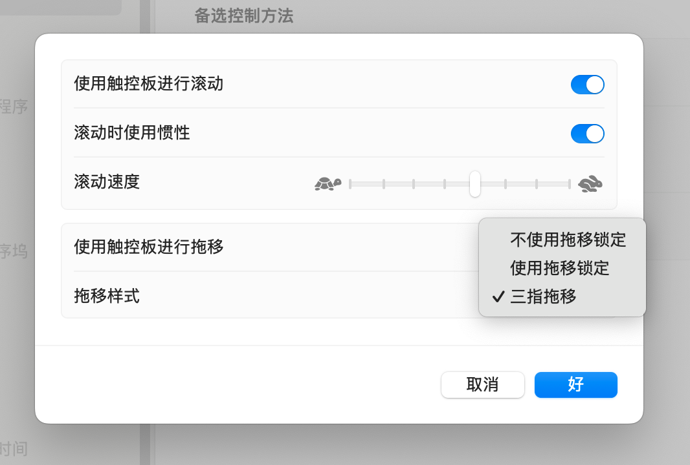
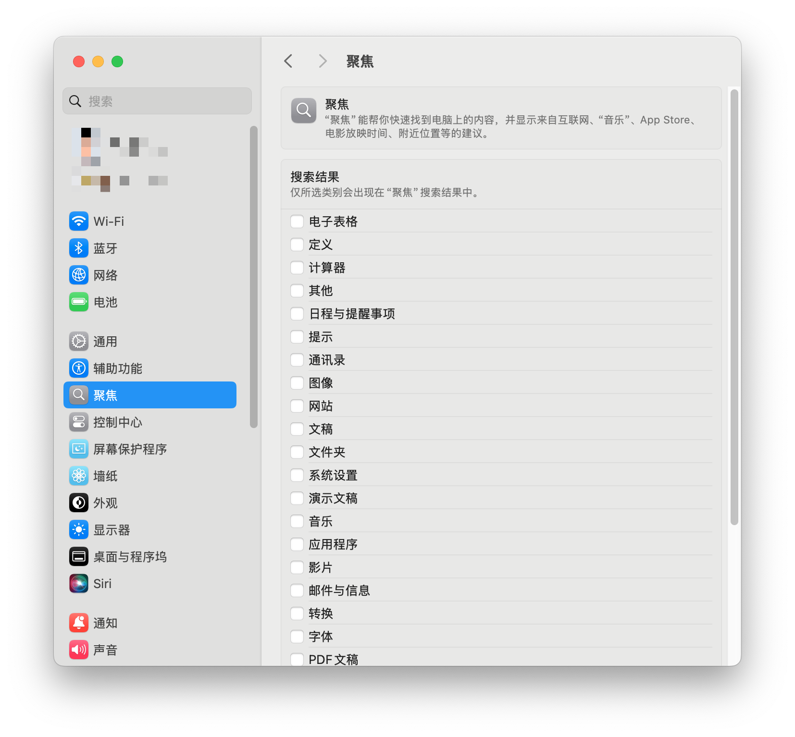

趁着国补，把手头用了 5 年的 MacBook Air M1 换成了 MacBook Pro 14 寸 M4. 顺便手动重新配置新电脑，在此记录一下每次设置新电脑时我会做的一些设置和必装的软件。

## 设置

把点按切换成轻点：

我不喜欢用触摸板点按拖动来移动窗口，觉得有点费力，所以我会调整为三指拖移。旧版本的 OS X 可以直接在系统设置中调整，新版本的 macOS 竟然把它归类到辅助功能里了：

把 Control 键和 Caps Lock 键互换。因为我需要频繁使用 Control 键，Caps Lock 的位置是最合适的，这也是 HHKB 的默认布局：

取消 Spotlight 的所有索引，因为我用 Raycast, Spotlight 的索引会浪费计算资源:

## 软件

- [Microsoft Edge](https://www.microsoft.com/en-us/edge): 用了很多年的主力浏览器
- [清歌五笔输入法](https://qingg.im/): 最好用的五笔输入法
- [Raycast](https://www.raycast.com/): 不必多说
- [Cursor](https://www.cursor.com/): 目前主力 IDE, 也是 Cursor 长期的订阅用户
- [CleanShotX](https://cleanshot.com/): 最好用的截图软件，除了截图还有很多好用的小功能（比如 OCR, 录屏）
- [1Password](https://1password.com/): 密码管理
- [Warp](https://www.warp.dev/): 主力 Terminal Emulator, 已经离不开通过 AI 写复杂的命令
- [iStat Menus](https://bjango.com/mac/istatmenus/): 在 Menu bar 显示系统信息，我用来实时看到网络传输速度和内存使用情况